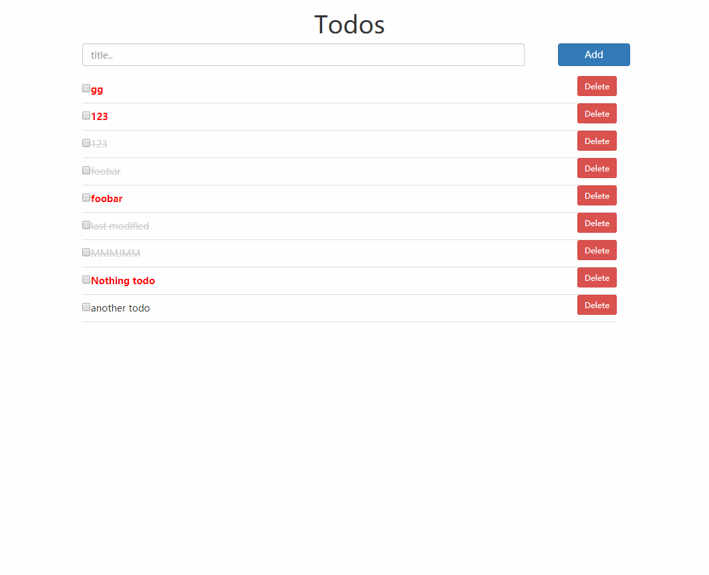

# Yet another Todo app

前后端分离。
- 后端：Django+DjangoRestFramework+PostgreSQL
- 前端：React+Redux+Bootsrap

## 安装
依赖：`python2.7`, `pipenv`, `node.js`, `yarn`。
```bash
git clone https://github.com/Hourann/todo-app.git todo
cd todo
# 后端
pipenv install
pipenv shell
vim backend/todo_api/settings.py # 修改postgres配置
python backend/manage.py runserver
# 前端
cd frontend
yarn install
yarn start
```
## 后端接口
- `/api/`
    - `GET`: 返回todo列表
    - `POST`: 增加一个新的todo，返回这个todo的json
- `/api/<id>`
    - `GET`:返回对应id的todo
    - `PUT`:修改todo
    - `DELETE`: 删除todo
## Todo模型
```python
class Todo(models.Model):
    # mandatory
    title = models.CharField(max_length=200)
    description = models.TextField(blank=True, default="")
    done = models.BooleanField(default=False, blank=True)

    # optional
    expire_date = models.DateTimeField(null=True, blank=True)
    priority = models.CharField(max_length=1, choices=(('H', 'High'), ('N', 'Normal')), default='N')
```
## redux store结构
```json
{
    todos: [
        {
            id: 1,
            title: "First Todo",
            description: "FooBar",
            done: false,
            expire_date: "",
            priority: "N",
        }
        ...
    ],
    visibility: 'SHOW_ALL',
    order: 'ID',
    isFetching: false,
    selectedId: null
}
```
- `visibility`用于控制可见性（目前未实现，预留）。

- `order`用于指定排序方式。目前只做了根据ID排序。

- `isFetching`用于控制HTTP请求，防止用户连续点击下的重复请求。

- `selectedId`用于指示正在编辑的todo id。
## 效果演示：


## 不足
做此项目的时候对HTML、CSS、Javascript都不熟，React+Redux更是第一次使用，边看文档边做。在做到后期的时候发现不少对这两个框架的用法的误解。有待改进的地方和有缺陷的地方有：
- 没有把控件区分为`container`和`component`
- 混用`react-bootstrap`控件和class属性。写法不统一。
- 用`checkbox`来进入详情编辑在交互上不友好。
- `datetime-local`控件替换
- 在传`Props`和使用`redux`的`connect`进行状态传递的写法上有些混乱
